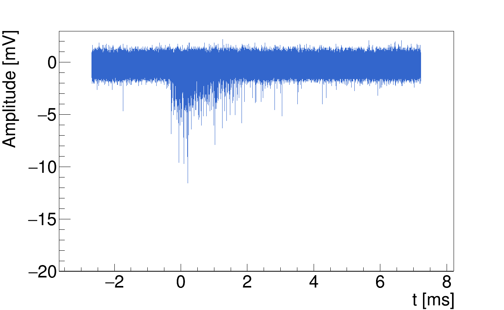
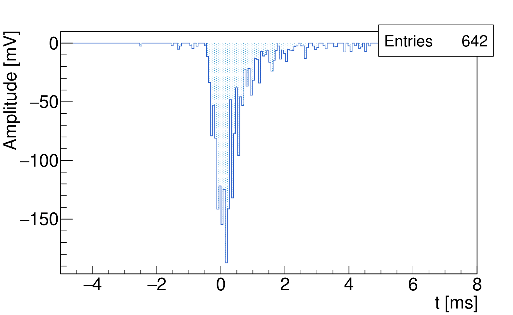
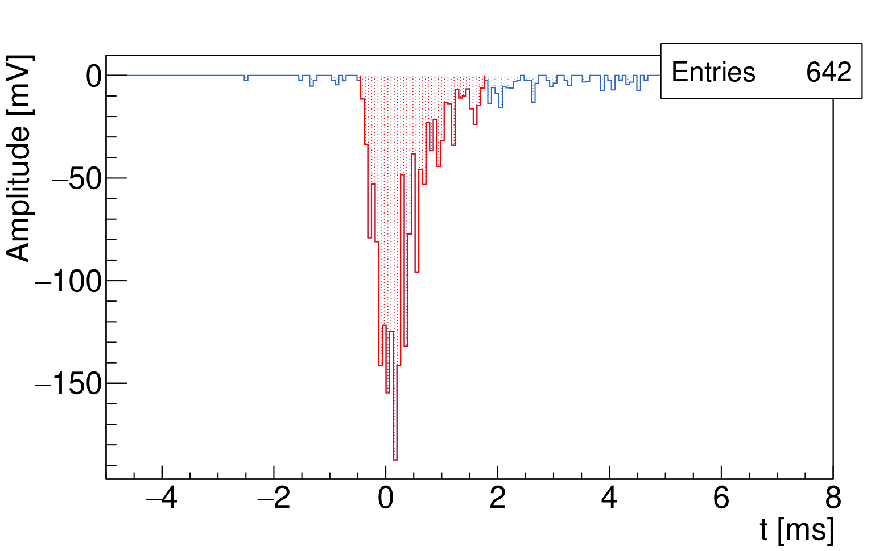
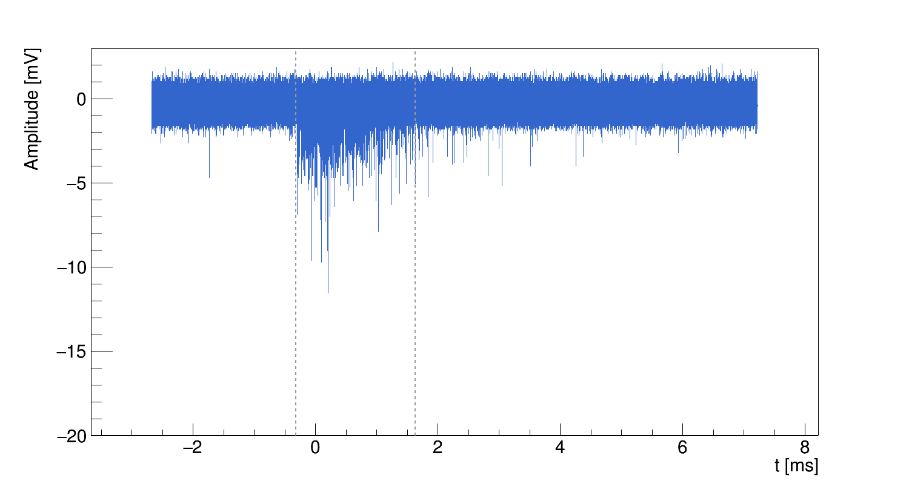

# NID PMT Waveform Analysis

This program analyzes PMT waveforms from gas scintillation in He:CF4 in negative‑ion drift (NID) operation, where negative ions are the charge carriers. This work was developed as part of a PhD thesis in the CYGNO group: [3D Tracking with the CYGNO/INTIUM experiment](https://arxiv.org/abs/2509.10890)


***Author: David José Gaspar Marques (PhD)***

## Code Overview (Main Blocks)
- **Inputs & setup**: parse arguments, open the output ROOT file, configure binning and thresholds.
- **Waveform loop**: read each `.trc`, compute RMS/threshold, and extract peaks above noise.
- **Histogram analysis**: find signal window, compute area/time window, and fill histograms.
- **Tree output**: store per‑waveform summary values in `NIDTree`.
- **Optional injection test**: inject synthetic peaks and compare results/plots.


## Inputs
- **Folder path**: directory containing `.trc` files
- **Output ROOT file**: `.root` file name for results
- **nBins**: number of bins for rebinned histogram
- **thresh_n_bins_above**: threshold (in counts) used by `analyse_histogram` to define the signal window

> Build/run example (adjust paths):
> 
> ```sh
> g++ -O3 -std=c++17 nid_pmt_waveforms_updated.cpp -lstdc++fs -o nid_analysis.out $(root-config --glibs --cflags)
> ./nid_analysis.out ./git_examples/3 output.root 200 10
> ```

## Key Options (in code)
The most important controls are in the **OPTIONS** block in `nid_pmt_waveforms_updated.cpp`:
- `check_consecutive_points`
- `draw_raw_plot`
- `draw_lines_plot`
- `draw_above_noise_plot`
- `inject_peaks_for_testing`
- `injection_ratio`

## Output ROOT File Contents
The output ROOT file contains histograms with information about the waveform and its derived quantities, plus a per‑waveform `TTree` for analysis.

The `TTree` stores one entry per processed waveform with these branches:

| Branch | Description |
|---|---|
| `Area` | Integrated area in the signal window |
| `Time_window` | Signal duration (`signal_end - signal_begin`) |
| `bin_start` | First bin index of signal window |
| `bin_end` | Last bin index of signal window |
| `signal_begin` | Signal start time (ms) |
| `signal_end` | Signal end time (ms) |
| `baseline` | Baseline value computed from RMS window |
| `RMS6` | $6\times$ RMS threshold value |
| `nPeaks` | Number of peaks above threshold |

### Optional Injection Plots (if enabled)
When fake peak injection is enabled, the code replaces a fraction of zero entries in the noise‑cut waveform with synthetic peaks, reruns the analysis, and writes comparison plots (original vs injected) to help validate stability.

## Example Images

<div style="display:grid; grid-template-columns: 1fr 1fr; gap: 12px;">
  
  
  
  
</div>

<div style="margin-top: 12px; text-align:center;">
  
</div>

**Legend:** Example of the analysis performed on NID PMT waveforms: (a) the original signal undergoes a (b) peak selection, where only those above $6\times$ RMS of the noise level are retained. From this, (c) a rebinning procedure is applied, and (d) the start and end timestamps are determined, from which the signal duration is calculated. (e) These timestamps are then overlaid onto the original signal.


## Feedback

Suggestions and improvements are welcome. For questions or to report issues contact the author at: david.jose.gaspar.marques@cern.ch


